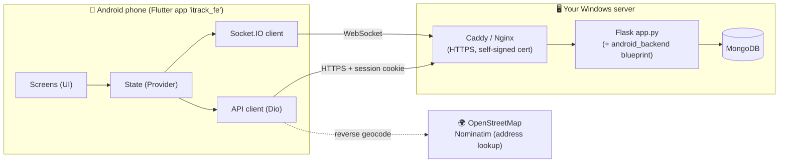
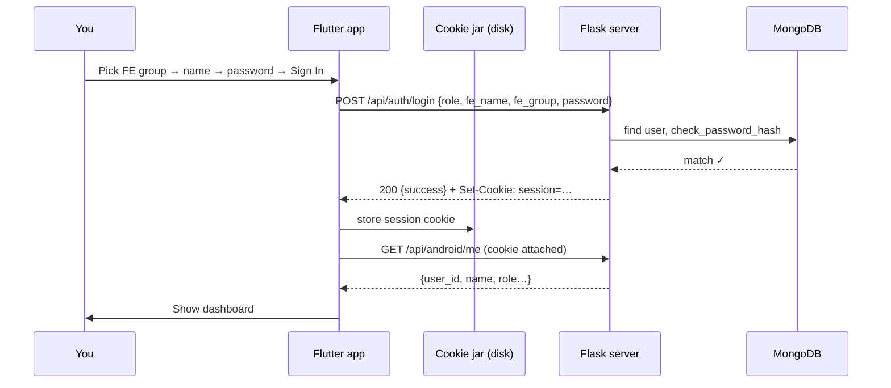
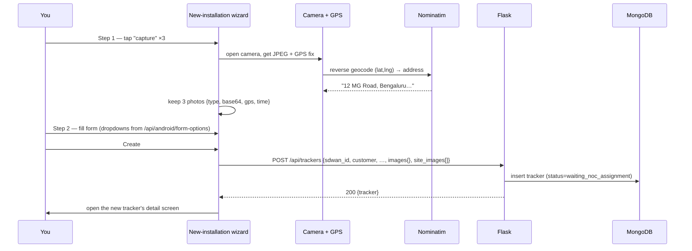
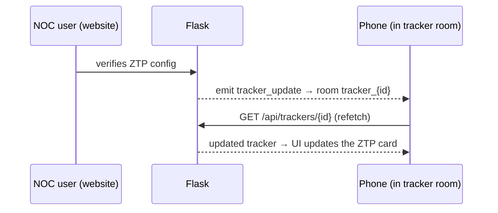

# iTrack FE App — Architecture

This is a **Flutter (Dart) Android app** that reproduces the **Field Engineer (FE)** experience of the iTrack web app. It does **not** have its own database or business logic — it talks directly to the **same Flask server** the website uses, over the same `/api/*` endpoints, authenticating with the same session cookie.

> New to mobile dev? Read this top-to-bottom once. Each layer is explained in plain language, then there are diagrams showing how a request travels from a tap on the phone all the way to MongoDB and back.

---

## 1. The big picture — who talks to whom



**Plain English:** The phone app is a *client*. Every time it needs data or wants to change something, it makes an HTTPS call to your Flask server (through the Caddy/Nginx reverse proxy). Flask reads/writes MongoDB and answers. For live updates (new chat message, status change) the app also keeps a **Socket.IO** connection open so the server can push changes without the app asking. The only *other* server it contacts is OpenStreetMap, purely to turn GPS coordinates into a street address (exactly like the website does).

---

## 2. The layers inside the app (the `lib/` folder)

Think of the app as an onion. A tap flows **inward** (UI → state → API), and data flows **back outward**.

| Layer | Folder | What it does | Analogy |
|---|---|---|---|
| **UI / Screens** | `lib/screens/`, `lib/widgets/` | What you see and tap. Buttons, lists, forms, photos. | The shop counter |
| **State** | `lib/state/` | Holds the current data for a screen and the logic for loading/refreshing it. Built with **Provider** (`ChangeNotifier`). | The shop assistant who remembers your order |
| **API client** | `lib/api/` | Turns "get my trackers" into an actual HTTP request and parses the JSON reply. | The phone the assistant uses to call the warehouse |
| **Services** | `lib/services/` | Device features: camera+compression, GPS+geocoding, the Socket.IO connection. | Specialist tools |
| **Models** | `lib/models/` | Dart classes that mirror the server's JSON (a `Tracker`, a `ChatMessage`). | Order forms with labelled boxes |
| **Utils** | `lib/utils/` | Shared rules copied from the website: status→colour map, the 3 dashboard buckets, IST time formatting. | The rulebook |

### Why "Provider" for state?
Provider is Flutter's officially recommended *simple* state management. Each screen has one state object (e.g. `DashboardState`) that extends `ChangeNotifier`. When data changes, it calls `notifyListeners()` and the screen rebuilds. There's nothing more exotic to learn — no code generation, no streams to wire by hand.

### The file map
```
lib/
├── main.dart                 App entry. Loads saved server URL + session, then runs the app.
├── app.dart                  Decides the first screen: Server Setup → Login → Dashboard.
├── theme/app_theme.dart      The FE "ocean_depths" colours + Fjalla One font.
├── api/
│   ├── api_client.dart        The one Dio instance. Cookies, errors, session-expiry, HTTPS.
│   ├── http_adapter*.dart     Platform-specific HTTP (native cookie jar vs web browser creds).
│   ├── auth_api.dart          Login, logout, login dropdowns, /me, /ping.
│   ├── trackers_api.dart      List, detail, create, ZTP, HSO, resubmit.
│   ├── chat_api.dart          Messages, send text/image, mark-read.
│   └── options_api.dart       Form dropdown lists.
├── models/                    Tracker, ChatMessage, User, FormOptions, GpsPoint.
├── state/                     One ChangeNotifier per screen (dashboard, detail, chat, wizard…).
├── services/
│   ├── socket_service.dart    The live Socket.IO connection + room joins.
│   ├── image_service.dart     Camera capture → compress to 1024px JPEG → base64.
│   └── location_service.dart  GPS fix + Nominatim reverse geocode.
├── screens/                   One file per screen.
├── widgets/                   Reusable pieces (tracker card, status badge, chat bubble…).
└── utils/                     status_maps, constants (buckets, statuses), time_utils (IST).
```

---

## 3. How login works — and why there are no "tokens"

The website logs you in by setting a **session cookie** in your browser. This app does the exact same thing: after a successful login, the Flask server sends a `Set-Cookie: session=…` header, and the app **saves that cookie to disk** (in a "cookie jar"). Every future request automatically includes it, so the server knows who you are. When you close and reopen the app, the cookie is still there — you stay logged in.

> There is **no JWT / bearer token**. The cookie *is* your credential. This is unusual for mobile apps but it means the phone behaves identically to the website.



### The one tricky bit: expired sessions
The website answers an unauthenticated API call with a **redirect to the login page (HTTP 302 + HTML)**, *not* a clean `401`. A mobile app expecting JSON would choke on that. So `api_client.dart` watches for "a redirect whose target contains `/login`" (or HTML where JSON was expected) and treats it as **"session expired"** → it logs you out gracefully and shows the login screen with a note. (The new `/api/android/me` endpoint returns a proper JSON `401`, which we use at startup to avoid the messy redirect entirely.)

---

## 4. How photos work — base64, not files

The iTrack server stores **all images inside MongoDB as base64 text** (data-URLs like `data:image/jpeg;base64,/9j/4AAQ…`). There is no file server, no image folder. The app follows the same rule:

- **Capturing:** camera → compress to max 1024px, JPEG quality 85 (matching the server) → convert bytes to a base64 data-URL string.
- **Sending:** that string goes straight into the JSON body (`images{}`, `site_images[]`).
- **Showing:** the `Base64Image` widget decodes the string back to bytes and shows it. Decoded images are cached in memory so scrolling stays smooth.

### Creating a tracker (the most involved flow)

(If the SDWAN ID already exists, Flask replies **409** and the app offers to open the existing tracker — same as the website.)

### Sending a chat image (two-step, matching the web)
```mermaid
sequenceDiagram
    participant App
    participant Flask
    App->>Flask: POST /chat/upload (multipart file)  ← server resizes to 1024px, re-encodes
    Flask-->>App: {file_url: "data:image/jpeg;base64,…"}
    App->>Flask: POST /chat/send {type:image, file_url}
    Flask-->>App: {message}  + broadcasts new_chat_message over Socket.IO
```

---

## 5. How live updates work (Socket.IO + polling)

The website uses a "hybrid" strategy and the app copies it exactly:

1. **Socket.IO** — the app opens one live connection and *joins rooms*: the dashboard room (`join_dashboard {user_id, role}`) and a per-tracker room (`join_tracker {tracker_id}`) when you open a tracker or chat. The server then pushes events into those rooms:
   - `tracker_update` → a tracker changed → refetch it
   - `new_chat_message` → append the message
   - `dashboard_update` / `user_notification` → refresh the list
2. **Polling** — as a safety net (in case the socket silently drops), every screen also re-fetches every **30 seconds**, and once more whenever the app returns to the foreground.



---

## 6. The `android_backend/` blueprint (server side)

The app needed three things the website didn't expose, so we added a **tiny, read-only Flask blueprint** mounted at `/api/android/*`. It lives in `android_backend/` in the main project and is registered with two lines in `app.py`.

| Endpoint | Auth | Why it exists |
|---|---|---|
| `GET /api/android/ping` | none | "Test Connection" on the Server Setup screen |
| `GET /api/android/me` | session | Returns the logged-in user's profile as clean JSON (incl. `user_id` needed for Socket.IO) and a real **401** when logged out |
| `GET /api/android/form-options` | session | The customer / SIM-provider / router dropdown lists, from a new `form_options` MongoDB collection (seeded by `scripts/seed_form_options.py`) |

**It never writes to trackers/users/chat.** All real actions still go through the existing web API routes, so there is no duplicated business logic and almost no risk to the website.

---

## 7. Self-signed HTTPS (production)

Your production server sits behind Caddy/Nginx using a **self-signed certificate**. A normal HTTPS client rejects those. The app is built to **trust that one certificate — but only for the exact host you configured** in Server Setup (never a blanket "trust everything"). This is handled in `http_adapter_io.dart` for API calls and mirrored via `HttpOverrides` for the Socket.IO connection. On the web build (Chrome preview) there is no such override — browsers handle certificates themselves.

---

## 8. Trade-offs & limitations (be aware)

- **Cookie auth on mobile** is unusual; there's no multi-device token refresh. If the server's `SECRET_KEY` changes, everyone is logged out.
- **Base64 images are heavy.** A create-tracker POST can be 1–3 MB; the dashboard/detail responses embed full images. On slow mobile data this is noticeable. (A future `/api/android/trackers/summary` endpoint could strip images from the list — noted, not built.)
- **No offline mode.** Every screen needs the server. A failed create means retaking photos.
- **Self-signed trust is "trust this host's cert", not certificate pinning** — simpler, but weaker against a network attacker on the same LAN.
- **Socket.IO has no authentication** on the server (an existing web limitation the app inherits).
- **Chrome build is UI-preview only** — see `TESTING.md`. Real use is the Android app.
